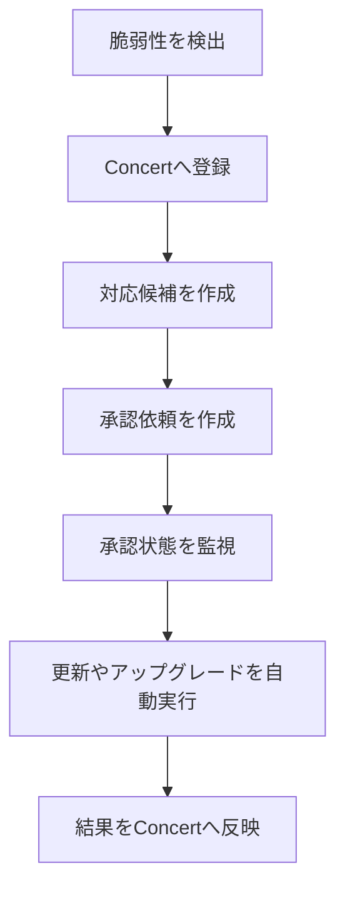
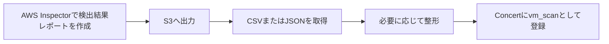
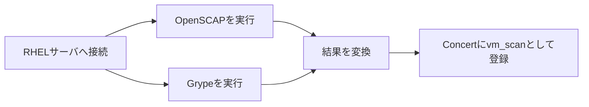
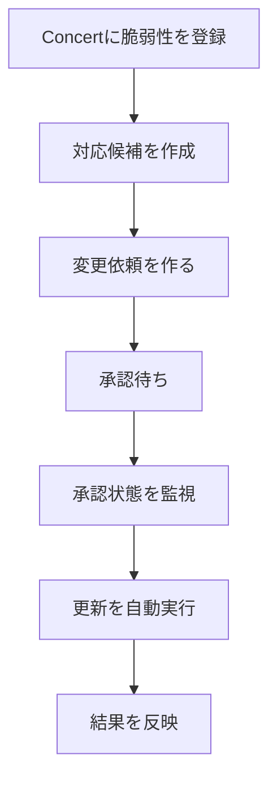
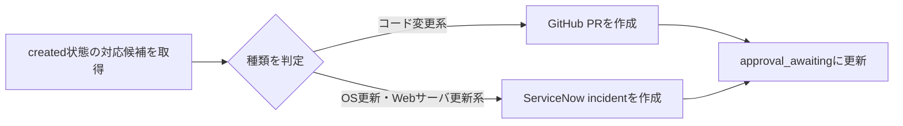
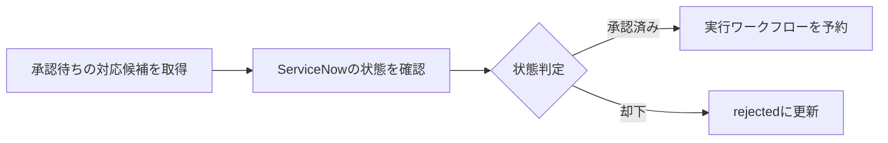
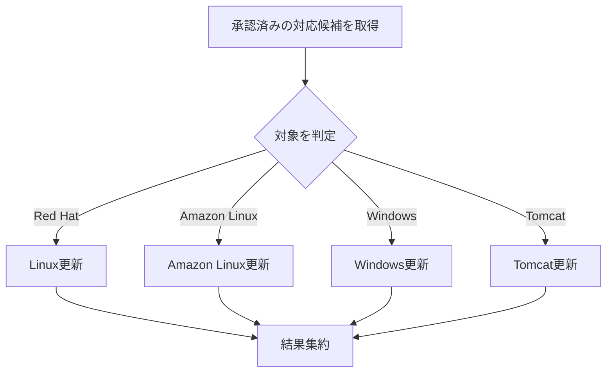

## EC2等のVM上で動くJavaアプリの脆弱性自動対応をどう組むか

`EC2` などの `VM` 上で動く Java アプリの脆弱性対応では、まず `Amazon Inspector` と `Systems Manager` を使う AWS native の構成が候補になります。AWS に閉じるなら、この流れはかなり自然です。

> 補足:
> `Amazon Inspector` は AWS の脆弱性検出サービス、`Systems Manager` はサーバ更新や運用操作を実行するための管理サービスです。

一方で、実際の運用では次のような悩みが出てきます。

- `Amazon Linux` だけでなく `RHEL` もある
- `Apache Tomcat` の更新も運用対象になる
- `Jira`、`GitHub`、`Teams` など周辺ツールも使っている

> 補足:
> `Teams` は、承認依頼や実行結果の通知先として連携するイメージです。

こうした前提では、`検出 -> 登録 -> 承認 -> 自動実行 -> 結果反映` をひとつの流れとして扱いやすい `Concert Workflows` の意味が出てきます。

> 前提:
> この記事は AWS を例にしていますが、`VM上のJavaアプリの脆弱性を検出し、登録し、承認を回し、自動実行につなぐ` という考え方自体は、他の `Public Cloud` でも大きくは変わりません。

- [IBM Concert](https://www.ibm.com/jp-ja/products/concert)
- [AIを活用した修復 - IBM Concertワークフロー](https://www.ibm.com/jp-ja/products/concert/workflows)

## Concert Workflows とは何か

Concert Workflows には `Automation Library` と呼ばれるテンプレート集があります。

- Automation Library: https://automation-library.ibm.com/workflows

ここからワークフローを取り込み、自分の環境に合わせて設定できます。
今回確認した範囲でも、以下のようなテンプレートがありました。

- AWS Inspector の結果を取り込む  
  https://automation-library.ibm.com/workflows/Fetch%20Scan%20files%20from%20AWS%20Inspector
- Amazon Linux の脆弱性情報を同期する  
  https://automation-library.ibm.com/workflows/Sync%20AWS%20Linux%20Bulletin
- `RHEL` 上で `OpenSCAP` と `Grype` を使ってスキャンする  
  https://automation-library.ibm.com/workflows/RHEL_SCAN_OSCAP_GRYPE
- 承認依頼を作る  
  https://automation-library.ibm.com/workflows/Create_Change_Request_For_Remediation_Action
- 承認状態を監視する  
  https://automation-library.ibm.com/workflows/Monitor_Remediation_Action_Status
- `Linux` / `Windows` / `Tomcat` の更新を実行する  
  https://automation-library.ibm.com/workflows/Remediation_Master

## 全体像

今回見た構成は、次の流れに整理できます。

ここで見ておきたいのは、Concert Workflows で脆弱性の検出、登録、承認、自動実行までを一連の流れとしてカバーできることです。

## 1. 脆弱性の検出と登録

まずは、脆弱性をどう検出し、どう Concert に登録するかを見ていきます。ここでは、その入口になる3つのテンプレートを紹介します。

重要なのは、この段階で単に脆弱性を見つけるだけではなく、後続の更新や対応に使える情報もあわせて用意していることです。環境によっては、修正版バージョン、セキュリティ情報、実行コマンドの候補までここで扱われます。

### Amazon Linux

Amazon Linux では、`ALAS` をもとに脆弱性情報や更新情報を扱う流れがありました。  
`Sync_AWS_Linux_Bulletin` のようなワークフローで Amazon Linux のセキュリティ情報を同期し、Concert 側で扱えるようにします。

- ALAS: https://alas.aws.amazon.com/
- ワークフロー: https://automation-library.ibm.com/workflows/Sync%20AWS%20Linux%20Bulletin

### AWS Inspector

`Fetch_Scan_files_from_AWS_Inspector` では、`AWS Inspector` の検出結果レポートを生成し、`S3` から取得して Concert に登録していました。

- ワークフロー: https://automation-library.ibm.com/workflows/Fetch%20Scan%20files%20from%20AWS%20Inspector

主に `EC2` 向けの package 脆弱性を Concert に渡す入口として使えます。修正版バージョンや package 情報もあわせて扱えるため、後続の対応方針にもつなげやすくなります。

### RHEL

`RHEL_SCAN_OSCAP_GRYPE` では、`RHEL` サーバ上で `OpenSCAP` と `Grype` を実行し、その結果を Concert に登録していました。

> 補足:
> `OpenSCAP` は Linux の脆弱性や設定準拠を確認する OSS ツール群、`Grype` は package やイメージの脆弱性を検出するスキャナです。

- ワークフロー: https://automation-library.ibm.com/workflows/RHEL_SCAN_OSCAP_GRYPE

ここでは3種類の検出方法を紹介しましたが、Concert は AWS に閉じず、マルチクラウドやオンプレミス環境でも対応可能です。

## 2. 登録後に何が起きるか

脆弱性情報が Concert に登録されると、Concert 側で対応候補が作られます。  
そのあとに動くのが、次の3つのワークフローです。

- `Create_Change_Request_For_Remediation_Action`  
  https://automation-library.ibm.com/workflows/Create_Change_Request_For_Remediation_Action
- `Monitor_Remediation_Action_Status`  
  https://automation-library.ibm.com/workflows/Monitor_Remediation_Action_Status
- `Remediation_Master`  
  https://automation-library.ibm.com/workflows/Remediation_Master

> ポイント:
> `検出結果の取り込み`、`承認依頼`、`承認監視`、`実行` まで、流れで捉えやすいのが分かります。

## 3. 変更依頼を作る

`Create_Change_Request_For_Remediation_Action` は、Concert 内に作られた対応候補を見て、承認依頼を作るワークフローです。

OS 更新系では、ServiceNow incident の URL や ID を対応候補の詳細情報に書き戻していました。  
いきなり更新を打つのではなく、まず変更依頼を起こせる点が実運用に合っています。

> 補足:
> `ServiceNow` は IT運用や変更管理でよく使われるチケット/ワークフロー製品です。
>
> ここでは `ServiceNow` を例にしていますが、実際の承認フローは `Jira` など他のチケット運用に置き換えて考えることもできます。

## 4. 承認状態を監視する

`Monitor_Remediation_Action_Status` は、承認待ちの対応候補を定期的に確認し、承認されたものを実行予約につなぐワークフローです。

Concert 側が `ServiceNow API` を定期的に確認する構成なので、ServiceNow 側に追加の通知連携を作りこまなくても承認状態を追えます。

## 5. 更新やアップグレードを自動実行する

`Remediation_Master` は、承認済みまたは実行予定の対応候補を取得し、対象に応じて処理を振り分けるワークフローです。

- `Apply_Linux_Patch`
- `Apply_Amazon_Linux_Patch`
- `Apply_Ubuntu_Patch`
- `Apply_Windows_Patch`
- `Upgrade_Tomcat`

Linux 系では `Ansible playbook` を使って更新しており、Tomcat も同じ流れに載せられます。  
ここが、`OSだけでなくJavaアプリ周辺まで含めて運用をまとめたい` 場面で効いてきます。

## 6. 実行結果の反映

更新後は `Patch_Summary_Update` のようなワークフローで結果を反映します。

- Concert 側の状態を `success` / `failed` に更新
- 実行履歴を追記
- `ServiceNow incident` 側も更新

> ポイント:
> `何を検出し、どう承認し、どう実行されたか` を追いやすいことが、Concert 側の大きな特徴です。

## AWS native との比較

AWS native でも、`Amazon Inspector`、`EventBridge`、`Systems Manager` を組み合わせれば近いことはできます。  
ただし、`IAM / RBAC`、承認、通知、例外処理まで含めると、設計はそれなりに必要になります。

比較のポイントは、多様な周辺サービスを組み合わせて脆弱性対応のパイプラインを作り、それをしっかり保守運用できるか、にあると思います。

## まとめ

`EC2` などの `VM` 上で動く Java アプリの脆弱性対応では、AWS native は有力です。  
一方で、`RHEL` や `Tomcat` まで対象に含め、`Jira` や `GitHub` で承認や変更管理を行い、`Teams` に通知しながら運用を回したいなら、Concert Workflows の意味が出てきます。

- AWS に素直に閉じるなら AWS native
- 脆弱性対応を、検出・承認・実行まで含めた一連の運用としてつなぎたいなら Concert Workflows
- 現実的には、`AWS を実行基盤として使いながら、運用全体の見え方を Concert で整える` という組み合わせが考えやすいです

もし今、脆弱性対応が `検出する人`、`承認する人`、`実行する人` のあいだで少しずつ分断されているなら、まずはその流れを一本につなげられるか、という視点で Concert および Concert Workflows を見てみる価値はあると思います。
