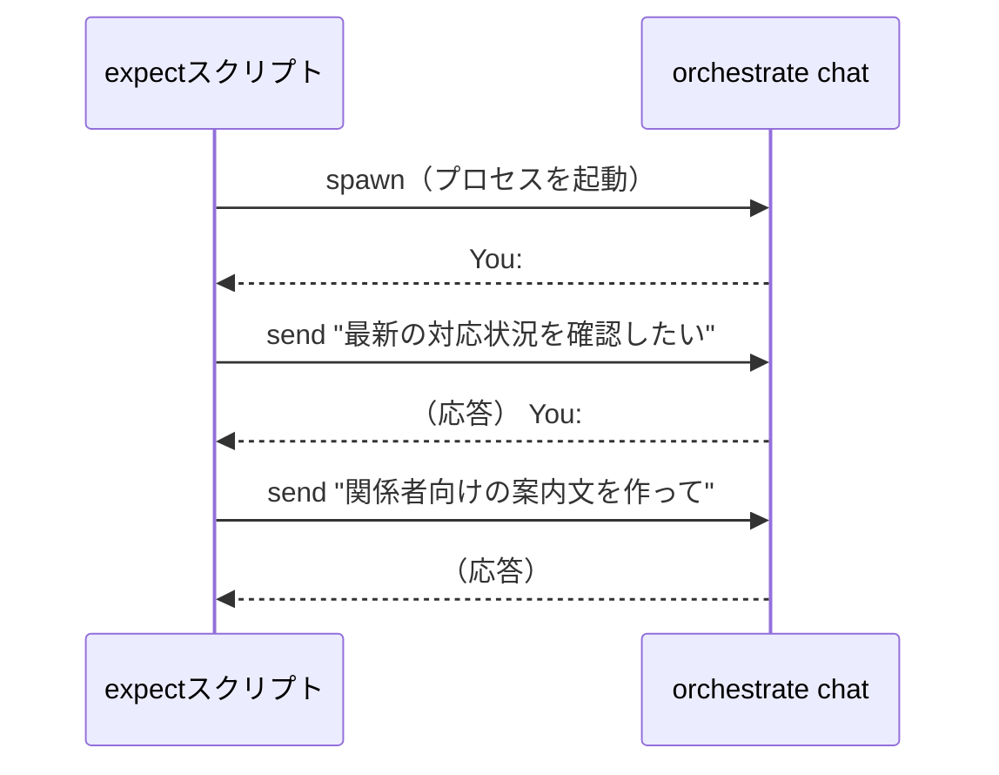
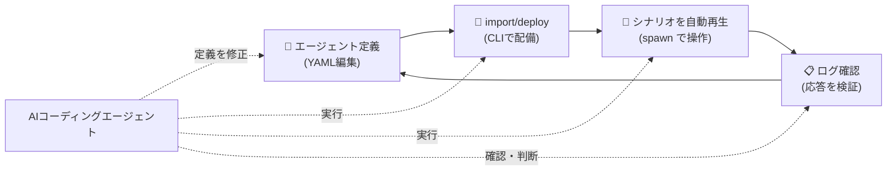

## はじめに
エージェント開発で修正・検証のサイクルを速く回したいとき、AIコーディングエージェントに任せやすい環境かどうかが効いてきます。設定がテキストで持てて、反映やテストが CLI で完結すると、「このプロンプトを変えて」「もう一度テストを流して」という繰り返しを AIコーディングエージェントに丸ごと任せられるからです。

その観点で触ってみてよかったのが IBM watsonx Orchestrate ADK（IBM が提供するエージェント開発・実行基盤）です。YAML 定義・CLI・対話の自動テストを組み合わせると、構築・検証・修正のサイクルをかなり軽く回せます。

---

## IBM watsonx Orchestrate ADK が向いている場面

エージェント開発のアプローチにはそれぞれ課題があります。

- **LangChain などのフレームワーク**：自由度は高いが、運用保守まで含めると工数がかかりやすい
- **Dify などのローコード**：立ち上がりは速いが、細かい修正・検証の繰り返しで UI 操作が増えてサイクルが重くなりがち

設定がテキストで持てて CLI で操作できる環境なら、Claude Code・Codex・IBM Bob（エンタープライズの開発フローに沿った動きが得意な IBM の AIコーディングエージェント）といったツールに修正・検証を丸ごと任せられます。IBM watsonx Orchestrate ADK はまさにその形に乗せやすいツールです。

## IBM watsonx Orchestrate ADK は YAML + CLI で完結する

IBM watsonx Orchestrate ADK では、エージェントを YAML で定義して、CLI でインポート・デプロイ・テストまで進められます。ADK の基本的なセットアップや概要は [こちらの記事](https://qiita.com/optimisuke/items/aac3cb872e1e488a2130) を参照してください。

### YAML でエージェントを定義する

```yaml
spec_version: v1
kind: native
name: operations_assistant
description: |
  定型業務を支援する業務アシスタント。
instructions: |
  【重要】必ず日本語で応答してください。
tools:
  - search_records
  - create_draft
  - send_notification
starter_prompts:
  prompts:
    - id: "check_status"
      prompt: "最新の対応状況を確認したい"
```

`instructions` や利用ツール、`starter_prompts` などをファイルとして持てるので、AIコーディングエージェントに「このルールを変えて」と依頼しやすいです。

### CLI で反映する

```bash
# ツールを登録
orchestrate tools import \
  -k python \
  -f "tools/example_tools.py" \
  -r tools/requirements.txt \
  -p tools

# エージェントを反映・デプロイ
orchestrate agents import -f "agents/operations_assistant.yaml"
orchestrate agents deploy --name "operations_assistant"
```

UI を何度も開いて操作するより、ファイルとコマンドで流れがつながっているほうが、修正の往復がかなり軽くなります。

### spawn コマンドで対話テストを自動化する

対話型エージェントは複数ターンの会話で品質が崩れやすいです。`spawn` コマンドを使うと、同じ会話パターンを繰り返し再生できます。

`spawn` はインタラクティブなコマンドを自動操作するツールです。`spawn` はゲームでいうスポーン（召喚）と同じで、操作対象のプロセスを「spawn の管理下で起動する」命令です。

`orchestrate chat ask` は、デプロイしたエージェントとインタラクティブに会話できる CLI です。`spawn` なしで実行すると、ターミナルがユーザー入力待ちになるだけです。`spawn` で起動するとセッションを握れるので、Orchestrate が返してくる `You:` というプロンプトを検知して、自動で次の入力を送れます。



```tcl
spawn orchestrate chat ask \
  --agent-name operations_assistant \
  --include-reasoning

expect "You:"                        # Orchestrate が "You:" を返すのを待つ
send "最新の対応状況を確認したい\r"  # 返ってきたら入力を送る

expect "You:"
send "関係者向けの案内文を作って\r"
```

なお、`expect` 自体は `You:` を検知して入力を送るだけです。期待する要件をテキストとして用意しておけば、AIコーディングエージェントが会話ログを見て「結果が要件を満たしているか」を確認してくれます。厳密な評価は ADK が別途提供している [Evaluate 機能](https://developer.watson-orchestrate.ibm.com/evaluate/overview) を使うのがよいですが、開発中の素早い確認にはこの組み合わせで十分です。

## AIコーディングエージェントとの相性がいい理由

この構成のよさは、YAML を直す → CLI で import/deploy → シナリオを自動再生 → ログを見てまた直す、という一連の流れが AIコーディングエージェントの得意領域に収まることです。



- LangChain のように深く作り込むほどではない
- でもローコードだけでは検証速度が物足りない

そういう場面で、YAML + CLI で回せる環境はかなり実用的です。IBM watsonx Orchestrate ADK はその要件をうまく満たしていました。

## まとめ

|                                    | LangChain                     | Dify などローコード | IBM watsonx Orchestrate ADK |
| ---------------------------------- | ----------------------------- | ------------------- | --------------------------- |
| 自由度                             | 高い                          | 低い                | 中程度                      |
| 立ち上がり                         | 遅い                          | 速い                | 速い                        |
| AIコーディングエージェントとの相性 | Code + CLI で完結しやすく良い | UI 操作が残りやすい | YAML + CLI で完結して良い   |

IBM watsonx Orchestrate ADK は「ローコードの手軽さ」と「AIコーディングエージェントに任せやすい構造」を両立しやすいツールです。YAML でエージェントを定義し、CLI で反映・デプロイし、spawn コマンドでテストを回す。この流れを AIコーディングエージェントに握らせることで、修正→検証のサイクルをかなり速く回せます。

PoC でエージェントを作って評価するサイクルを何度も回す中で実感したのですが、エンジニアとしてはコードで書きたい気持ちもあるし、運用を考えるとローコードを使いたい気持ちもあります。その両方の欲求をうまく満たしつつ、AIコーディングエージェントに任せて爆速で評価を回せたのはとても気持ちよかったです。IBM watsonx Orchestrate を触られている方はぜひ、テストも含めてAIコーディングエージェントと組み合わせてみてください。

## 参考

- [IBM watsonx Orchestrate ADK で始める爆速 AI Agent 開発 - Qiita](https://qiita.com/optimisuke/items/aac3cb872e1e488a2130)
- [IBM watsonx Orchestrate Agent Development Kit - 公式ドキュメント](https://developer.watson-orchestrate.ibm.com/)
