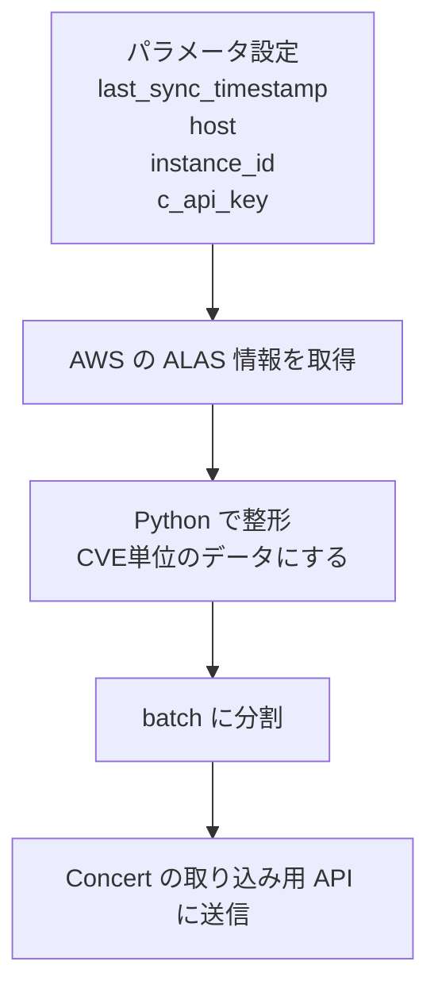

# はじめに

`IBM Concert` は、運用データや構成情報をもとに、システムのリスクや対応ポイントを把握するためのプラットフォームです。`IBM Concert Workflows` は、その周辺で必要な取得・連携・実行処理を組むためのワークフロー機能です。`Automation Library` にはさまざまなワークフローサンプルがありますが、本記事ではそのうちの1つである [`Sync AWS Linux Bulletin`](https://automation-library.ibm.com/workflows/Sync%20AWS%20Linux%20Bulletin) を題材にして、このワークフローがどう動いているのかを追っていきます。

このサンプルでは、`Concert Workflows` が外部の脆弱性情報を取得し、整形し、Concert に登録する取り込みパイプラインとして使えることが分かります。実際には、AWS が公開している `Amazon Linux Security Advisory (ALAS)` を取得し、Concert で扱いやすい形に整形してから、取り込み用 API 経由でConcertの内部データとして登録しています。この記事では、個別の Python コードの細部よりも、`Concert Workflows` がどこまでデータ取り込みに使えるかを見ていこうと思います。

## 全体像



ざっくり言うと、外部の脆弱性情報を取得し、Concert の内部データとして使える形に変換して登録するワークフローです。

Automation Library 上の画面イメージも見ておくと、全体の流れと block 構成がつかみやすくなります。


## 何を取得しているか

取得元は AWS の以下のページです。

- https://alas.aws.amazon.com/index.html

ここから advisory 一覧を取り、主に以下の情報を使っています。

- 作成日
- 更新日
- advisory ID
- severity
- package
- CVE

1つの advisory に複数の CVE が含まれる場合があるため、ワークフロー内では最終的に `CVE` 単位のレコードに展開しています。

## Python ブロックの役割

中核は `FaaS` の Python ブロックで、実質的には ETL を担当しています。

- `Extract`: AWS の ALAS ページを取得
- `Transform`: HTML を解析して CVE 単位のデータに整形
- `Load`: すぐに保存するのではなく、後続の取り込み用 API に渡せる形にする

また、`last_sync_timestamp` が渡されている場合は、それ以前のデータをスキップし、差分同期として動作します。

## Python で追加取得している情報

このワークフローでは、一覧ページの情報だけではなく、詳細ページも参照して補足情報を取っています。コード上では、詳細ページから `Issue Correction` を探し、更新コマンドの文字列を抜き出しています。

```python
def get_issue_correction(original_advisory_id):
    advisory_url = f"{BASE_URL}/AL2023/{original_advisory_id}.html"
    response = requests.get(advisory_url, headers=headers)
    soup = BeautifulSoup(response.text, features="html.parser")
    correction_div = soup.find('div', id='issue_correction')
    if correction_div:
        text = correction_div.get_text(separator=' ').strip()
        match = re.search(r'(?:dnf|yum|microdnf|dnf5) update [^\\s]+(?: [^\\s]+)*', text)
        if match:
            return match.group(0).strip()
```

ここで取得しているのは、たとえば以下のような更新コマンド例です。

- `dnf update ...`
- `yum update ...`

これはワークフローが独自に対応方法を生成しているのではなく、AWS の公開ページにある情報を追加で取得しているだけです。

## 取り込み用 API に送るデータ

ワークフローは整形したデータを batch ごとにまとめ、Concert の取り込み用 API に `POST` しています。ここでいう `取り込み` は、外部データを Concert の内部データとして登録する処理を指しています。API の仕様参照先としては [`create_advisory`](https://developer.ibm.com/apis/catalog/concert--ibm-concert-api/api/API--concert--ibm-concert-api-v2-1-0-0#create_advisory) があります。

同じConcertに取り込むのにAPIを呼び出しているところに対して少し違和感があるかもしれませんが、このサンプルでは Concert の内部データにも API 経由で登録する形になっています。

body の形は概ね以下のとおりです。

```json
{
  "advisories": [
    {
      "id": "uuid",
      "key": "CVE-..._OS_amazonlinux_2023",
      "cve": "CVE-...",
      "advisory_recommender": "amazonlinux",
      "advisory": "ALAS2023-...",
      "product": "amazon linux",
      "os_version": "2023",
      "advisory_payload": "{\"metadata\":{\"issue_correction\":\"dnf update ...\"}}",
      "severity": "Low",
      "cpe": ""
    }
  ]
}
```

ポイントは、`issue_correction` がトップレベル項目ではなく、`advisory_payload` の中に格納されている点です。

つまり Concert 側で固定的に見えているのは `advisories` 配列やその基本フィールドであり、`advisory_payload` はそこに収まりきらない補足情報を持たせる入れ物として使っているように見えます。Concert Workflows の価値は単に API を呼べることではなく、外部データを Concert が受け取りやすい形に寄せて登録できることにあります。

## おわりに

[`Sync AWS Linux Bulletin`](https://automation-library.ibm.com/workflows/Sync%20AWS%20Linux%20Bulletin) は、AWS の ALAS を取り込み、Concert の内部データとして登録するワークフローです。

構成自体はシンプルで、

1. 外部データを取得する
2. Python で整形する
3. 取り込み用 API に流し込む

という流れになっています。

Concert Workflows のユースケースとして見ると、単なる自動化フローというより、外部の運用データや脆弱性情報を Concert に取り込むための取り込みパイプラインとして捉えると理解しやすいです。

同じ考え方で他の OS やデータソースにも広げることはできますが、その場合は取得元のデータ構造や対応方法の情報の持ち方に応じて、整形ロジックを調整する必要があります。

他にもいろいろなサンプルがあるので、ご自身のユースケースに合わせて、似たものを探してみてください。

## 参考リンク

ワークフロー配布ページ: 
https://automation-library.ibm.com/workflows/Sync%20AWS%20Linux%20Bulletin

Concert API カタログ:
https://developer.ibm.com/apis/catalog/concert--ibm-concert-api/api/API--concert--ibm-concert-api-v2-1-0-0#create_advisory
