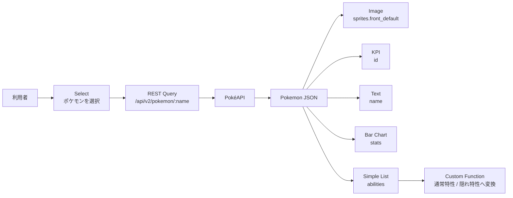

## REST API から小さな運用ダッシュボードを作ってみる

IBM Concert は、システムやアプリケーションの状態を横断的に把握するための製品です。Data Apps はその中で、API やデータソースをつないで、必要な情報をダッシュボードとしてカスタマイズして見せるための機能です。

IBM Concert Data Apps で何ができるのかを知るには、ドキュメントを読むだけでなく、シンプルなダッシュボードを1つ作ってみるのが早そうです。

今回は PokéAPI を使って、ポケモン図鑑風のダッシュボードを作りました。Select、KPI、Image、Bar Chart、Simple List を並べ、選択したポケモンに応じて表示を切り替える構成です（各コンポーネントは後ほど説明します）。IT運用の画面に置き換えると、対象システムを選んで、メトリクスやアラートをまとめて見る画面に近いです。

完成イメージはこちらです。


ライトモードで見ると、このような表示になります。


実際に画面を操作している様子です。


この記事では、作り方の細かい手順よりも、Concert Data Apps で何ができるのか、IT運用ダッシュボード目線でどこが使えそうかを整理します。ダッシュボード製品や運用可視化ツールを比較している人が、「Concert だとどこまで画面を作れるのか」を掴むための内容にしました。

試した範囲ではありますが、Data Apps は「ユーザー操作で表示を切り替えられるダッシュボード」に必要な部品がありました。

| 観点       | 所感                                                            |
| ---------- | --------------------------------------------------------------- |
| API連携    | REST API の結果をウィジェットに渡せる                           |
| 操作性     | Select （選択リスト）の値で複数ウィジェットを連動できる         |
| 表示部品   | KPI、画像、テキスト、棒グラフ、表形式のリストを組み合わせられる |
| データ加工 | Path指定と Custom Function で軽い整形ができる                   |
| 再利用     | export/import で画面設定をJSONとして扱える                      |
| 未検証     | 権限管理、大量データ、複雑な認証、チーム開発の差分管理          |

## 作ったもの

3匹のポケモンを横並びで比較できるダッシュボードです。

| 表示         | Concert Data Apps の部品 | 使ったデータ            |
| ------------ | ------------------------ | ----------------------- |
| ポケモン選択 | Select                   | 固定の選択肢            |
| 画像         | Image                    | `sprites.front_default` |
| 図鑑番号     | KPI                      | `id`                    |
| 名前         | Text                     | `name`                  |
| 種族値グラフ | Bar Chart                | `stats`                 |
| 特性一覧     | Simple List              | `abilities`             |

Select は、利用者が画面上で対象を選ぶための入力部品です。見た目としては選択リスト（ドロップダウン・プルダウン）に近く、今回は `フシギダネ` のような日本語ラベルを表示しつつ、API には `bulbasaur` のような英語名を渡す構成にしました。この Select の値を起点に、画像、KPI、グラフ、一覧が同じポケモンに切り替わります。

Data Apps は、Concert の画面から作成・管理できます。新しい Data App を開くと、キャンバス上に部品を配置して画面を組み立てていく形です。


画面部品は Components パネルから選び、それぞれにデータソースや表示項目を設定していきます。


データソースは PokéAPI の REST API です。

```text
https://pokeapi.co
GET /api/v2/pokemon/{name}
```

Data Source には REST として `https://pokeapi.co` を登録しました。


実際の業務で置き換えるなら、ポケモン選択はシステム選択、図鑑番号はインシデント数やリスクスコア、種族値グラフはCPUやエラー率、特性一覧は関連アラートや依存コンポーネントの一覧に近いです。

今回試した完成版の設定は `Pokemon.json` として export できるところまで確認しました。JSONはテキストなので、設定内容を生成AIでも確認しやすいです。

IDE上では、部品をキャンバスに配置しながら設定していきます。


## 全体の構成



Data Apps の中では、Select の値を API パスに埋め込み、そのレスポンスを各ウィジェットに分配しています。

## Data Apps を評価するうえで見えたこと

今回確認したのは、主に次の5つです。

- REST API をデータソースにする
- レスポンスのJSON の一部をウィジェットに割り当てる
- Select の値で複数ウィジェットを連動させる
- 表示用にデータを少し加工する
- 作った画面を export/import で再利用する

REST のパスには、Select の値を埋め込めました。

```text
/api/v2/pokemon/{{widget['<SelectのWidget ID>'].value}}
```

これにより、「対象システムを選ぶと、メトリクス・アラート・関連リソースがまとめて切り替わる」ような画面を作れます。

APIレスポンスは、必要なフィールドだけを指定して使えます。たとえば Image は `sprites.front_default`、KPI は `id`、Bar Chart は `stats` を見ています。運用データはネストしたJSONで返ってくることが多いので、Pathで必要な場所だけ拾えるのは重要です。

Simple List では、PokéAPI の `abilities` を表示しました。ここでの `is_hidden` は、「その特性が隠れ特性かどうか」を表す true / false です。そのままだと boolean のチェック表示になるため、Custom Function で `通常特性` / `隠れ特性` という文字列に変換しています。

```js
function transform(data) {
  return data.map((row) => ({
    ...row,
    ability_kind: row.is_hidden ? "隠れ特性" : "通常特性",
  }));
}
return transform(data);
```

Data Apps の Transformation は、API レスポンスをウィジェットに渡す前に、Path の切り出しや Custom Function による整形を挟むための設定です。Custom Function の設定画面では、変換後に追加した `ability_kind` を Simple List の列として使っています。


## 使う前に知っておくとよさそうな癖

Select の表示ラベルと、APIに渡す値は別です。画面には `フシギダネ` と出しつつ、APIには `bulbasaur` を渡します。この値がずれていると、APIが 404 を返します。

Simple List では、少し癖がありました。ポケモン全体のレスポンスをそのまま渡すのではなく、Transformation で `abilities` の配列部分を切り出してから表示する必要があります。つまり、表示部品に渡す前に「どのデータを行として扱うか」を明示する必要がありました。このあたりは UI だけだと最初わかりにくく、試行錯誤が必要でした。

## IT運用ダッシュボード目線での印象

Concert 自体が IT運用のための製品なので、Data Apps も汎用BI（ビジネスインテリジェンス）ツールというより、「運用で見たい情報を、APIやデータソースから引いて、アプリっぽい画面にまとめる」用途との相性がよさそうです。

ダッシュボード製品や運用可視化ツールとして比較するときは、次の観点を見るとよさそうです。

| 見たいこと                             | Data Appsで確認したいポイント                      |
| -------------------------------------- | -------------------------------------------------- |
| 現場向けの小さな運用画面を早く作れるか | Select、KPI、Chart、Simple List の組み合わせやすさ |
| API中心の運用データを扱えるか          | REST Data Source と path 指定の使いやすさ          |
| 画面の再利用や横展開ができるか         | export/import JSON の扱いやすさ                    |
| 本番運用に乗せられるか                 | 権限、認証、性能、保守性                           |

今回は、REST 連携のダッシュボードを作る流れを確認しました。権限管理、大量データ表示時の性能、複雑な認証が必要なAPIとの接続、チーム開発時の注意点等は、別途整理しようと思います。

## まとめ

IBM Concert Data Apps では、REST API からデータを取って、Select / KPI / Chart / Simple List などを組み合わせたダッシュボードを作れました。

今回のポケモン図鑑は遊びの題材ですが、「対象を選ぶ」「APIで情報を取る」「KPIやグラフや表に分けて見せる」「必要なら少し加工する」という流れは、運用ダッシュボードの基本に近いです。

Data Apps を評価するときは、自社の運用APIを1つ選び、Select、KPI、Chart、Simple List に分けて表示できるかを見ると、製品の向き不向きを判断しやすいと思います。

## 参考にした公式ドキュメント

https://www.ibm.com/docs/en/concert/2.3.x?topic=overview-introduction-concert
 
