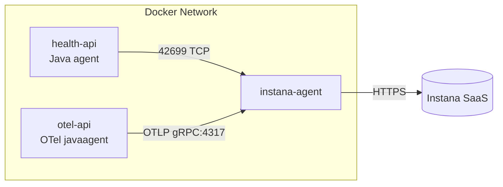

# はじめに

Instana Agent をコンテナで立て、Spring Boot アプリから

- Instana Java Agent
- OpenTelemetry Java Agent

の 2 パターンでトレース/メトリクスを送って動作確認します。

コード:

https://github.com/optimisuke/hello-instana

# 試したこと

以下の順番で試しました。通信が多い時は、一歩ずつ進めるの大事。

1. Instana Agent をコンテナでビルドして Instana バックエンド接続しメトリクスを確認。
2. Instana Agent に java アプリから instana java agent でデータを送るようにしてトレースを確認。
3. Instana Agent に java アプリから otel java agent で接続してトレースを確認

詳細はコードを見てください。

# Instana Agent の準備

Instana UI から情報取得できます。


# 構成

以下のような構成にしました。環境依存を減らすために docker で試してます。



- `instana-agent`: Instana Agent コンテナ（APM + OTLP 受信）。`INSTANA_AGENT_ENDPOINT`/`KEY` は `.env` で指定。
- `health-api`: Spring Boot 簡易ヘルス API。Instana Java agent を同梱して Instana Agent 経由で送信。`/health` が 200 OK。
- `otel-api`: Spring Boot 簡易ヘルス API。OpenTelemetry Java auto-instrumentation (v1.33.0) で起動し、OTLP gRPC で Instana Agent (`http://instana-agent:4317`) に送信。`/health` が 200 OK。

# 主要ファイル

主要な設定は以下のとおりです。

## OTel の方の Java のコンテナ

```Dockerfile
FROM maven:3.9-eclipse-temurin-21 AS build
WORKDIR /app
COPY pom.xml .
RUN mvn -B -q dependency:go-offline
COPY src ./src
RUN mvn -B -q package -DskipTests

FROM eclipse-temurin:21-jre
WORKDIR /app
COPY --from=build /app/target/otel-api-0.0.1-SNAPSHOT.jar app.jar
ENV OTEL_JAVA_AGENT_VERSION=1.33.0
# Download the OpenTelemetry Java auto-instrumentation agent (public).
RUN set -eu \
 && curl -Lf "https://github.com/open-telemetry/opentelemetry-java-instrumentation/releases/download/v${OTEL_JAVA_AGENT_VERSION}/opentelemetry-javaagent.jar" \
      -o /opt/otel-javaagent.jar
EXPOSE 8080
ENTRYPOINT ["java","-javaagent:/opt/otel-javaagent.jar","-jar","/app/app.jar"]
```

## Instana の方の Java コンテナ

```Dockerfile
FROM maven:3.9-eclipse-temurin-21 AS build
WORKDIR /app
COPY pom.xml .
RUN mvn -B -q dependency:go-offline
COPY src ./src
RUN mvn -B -q package -DskipTests

FROM eclipse-temurin:21-jre
WORKDIR /app
COPY --from=build /app/target/health-api-0.0.1-SNAPSHOT.jar app.jar
# Download the Instana Java agent from Maven Central (public, no auth required).
RUN set -eu \
 && curl -Lf "https://repo1.maven.org/maven2/com/instana/instana-javaagent/1.0.0/instana-javaagent-1.0.0.jar" \
      -o /opt/instana-agent.jar
EXPOSE 8080
ENTRYPOINT ["java","-javaagent:/opt/instana-agent.jar","-jar","/app/app.jar"]
```

## コンテナの連携

```yaml:docker-compose.yaml
services:
  instana-agent:
    image: icr.io/instana/agent
    privileged: true
    pid: "host"
    environment:
      INSTANA_AGENT_ENDPOINT: ingress-magenta-saas.instana.rocks
      INSTANA_AGENT_ENDPOINT_PORT: 443
      INSTANA_AGENT_KEY: ${INSTANA_AGENT_KEY:-}
      INSTANA_DOWNLOAD_KEY: ${INSTANA_DOWNLOAD_KEY:-}
      INSTANA_AGENT_OPEN_TELEMETRY_GRPC_LISTEN_ADDRESS: 0.0.0.0
      INSTANA_AGENT_OPEN_TELEMETRY_HTTP_LISTEN_ADDRESS: 0.0.0.0
    volumes:
      - /var/run:/var/run
      - /run:/run
      - /dev:/dev:ro
      - /sys:/sys:ro
      - /var/log:/var/log:ro

  health-api:
    build:
      context: ./health-api
    ports:
      - "8080:8080"
    environment:
      - SPRING_PROFILES_ACTIVE=default
      - INSTANA_AGENT_HOST=instana-agent
      - INSTANA_AGENT_PORT=42699

  otel-api:
    build:
      context: ./otel-api
    ports:
      - "8081:8080"
    environment:
      - SPRING_PROFILES_ACTIVE=default
      - OTEL_SERVICE_NAME=otel-api
      - OTEL_EXPORTER_OTLP_ENDPOINT=http://instana-agent:4317
      - OTEL_EXPORTER_OTLP_PROTOCOL=grpc
      - OTEL_TRACES_EXPORTER=otlp
      - OTEL_METRICS_EXPORTER=otlp
      - OTEL_LOGS_EXPORTER=otlp

```

# 結果

メトリクス確認する際は、hostname で検索するのが良いと思います。コンテナだとこれでわかります。

```bash
docker compose exec instana-agent hostname
```


トレースは今回の設定だと`otel-api`で検索できました。


# おわりに

Instana 等の APM って導入・お試しの心理的ハードル高いと思うのですが、ローカルでコンテナ使えば比較的簡単に試せるので興味あればぜひ。
