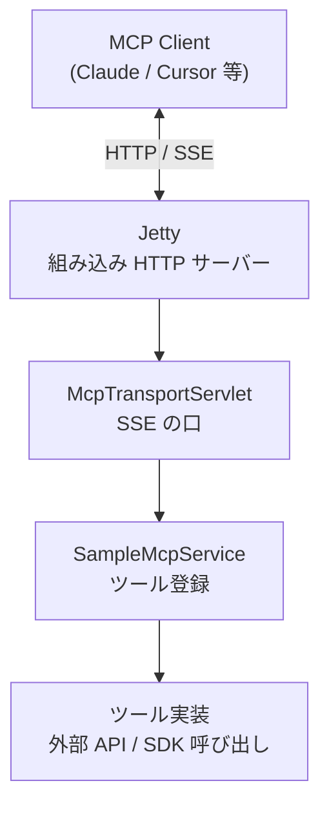

# はじめに

MCP サーバーの Java 実装を引き継ぐことになりました。Jetty を使っていたのですが、「なぜ Jetty なのか」「transport って何なのか」がよくわからなくて、コードを読みながら調べた記録です。

Java メインではなく、他の言語の方が慣れている自分が調べながら整理したので、同じような人の参考になれば。

# MCP サーバーとは

AI クライアント（Claude, Cursor 等）から呼ばれる「ツール」をホストするサーバーです。ツールの中身は何でもよくて、DB クエリでも外部 API 呼び出しでもファイル書き込みでも。MCP というプロトコルに沿っていれば、AI 側から「このツールを呼ぶ」と指示が来て実行してくれます。

# MCPの接続方式の現状

MCP の接続方式（transport）を調べると、現行仕様（2025-03-26）では2種類が定義されています。

| transport           | 概要                                                         |
| ------------------- | ------------------------------------------------------------ |
| **stdio**           | クライアントがサーバーをサブプロセスとして起動。ローカル専用 |
| **Streamable HTTP** | HTTP で通信。サーバーが独立プロセスとして動く。現行標準      |

それとは別に、**旧 HTTP+SSE transport** というものがあります。こちらは2025-03-26 の仕様改訂で deprecated になっていて、Streamable HTTP への移行が推奨されています。今も動くし各 SDK も対応していますが、新規に作るなら Streamable HTTP を選ぶのが無難そうです。

今回引き継いだコードは旧 HTTP+SSE transport の実装でした。Streamable HTTP にもしたいと思いつつ、ここではSSEの構成前提で説明します。

# Java での選択肢

Java で MCP サーバーを作る場合、フレームワークの選択肢はいくつかあります。

| 選択肢                    | 特徴                                                   |
| ------------------------- | ------------------------------------------------------ |
| **Spring Boot + MCP SDK** | 情報が多い。依存は重め                                 |
| **Quarkus**               | ネイティブイメージ対応。0 から作るなら選択肢になりそう |
| **Jetty**                 | 既存 Java コードに追加したいとき。依存を絞りやすい     |

引き継いだコードに Jetty が採用されていた理由は聞いてませんが、おそらく、既存の Java クライアントコードに MCP の口を足す構成だったので、Spring Boot をまるごと入れるより Jetty を薄く乗せる方が自然だったのかなと思います。

# Jetty とサーブレットとは

Java に慣れていないと「サーブレット」という言葉自体がピンとこないのですが、サーブレットは HTTP リクエストを受け取って処理するクラスのことです。**Jetty** はそのサーブレットを動かす HTTP サーバーで、今回は `new Server(8080)` とコードに直接書いて Jetty を起動しています。Spring Boot のような外部フレームワークを使わずに HTTP サーバーが立ち上がるイメージです。Java以外の人フレンドリーなシンプルな構成でした。

# 構成の全体像

構成は4層になっています。

- **Jetty** — HTTP リクエストを受け取る
- **McpTransportServlet** — MCP SDK の `HttpServletSseServerTransportProvider` を継承したサーブレット。クライアントとの SSE 接続を管理する
- **SampleMcpService** — `McpSyncServer.addTool()` でツールを登録する。どんなツールが使えるかを MCP クライアントに伝える
- **ツール実装** — 実際に何かをする場所。ここだけが用途に依存する

上の3層は「MCP をサーブするための共通部分」なので、ツール実装層だけを入れ替えれば違う用途にも使い回せます。

# ツール実装層に何を置くか

今回のコードでは OSLC という IBM ELM の REST プロトコルを呼ぶ Java SDK がツール実装層に入っています。MCP 層は OSLC を何も知らないし、OSLC 側も MCP を知らない。その間の繋ぎとして MCP サーバーがある、という構成です。

用途に応じてここを差し替えれば、DB クライアントでも社内 API のラッパーでも同じ構成で動かせると思います。

# おわりに

- 接続方式は Streamable HTTP が現行標準。旧 HTTP+SSE は動くが deprecated
- Jetty 組み込みは既存 Java 資産への追加に向く選択肢の一つ
- 4層の切り分けが分かると、引き継いだコードのどこを触れば何が変わるかが見えやすくなりました

間違いや補足があればコメントで教えてください。
